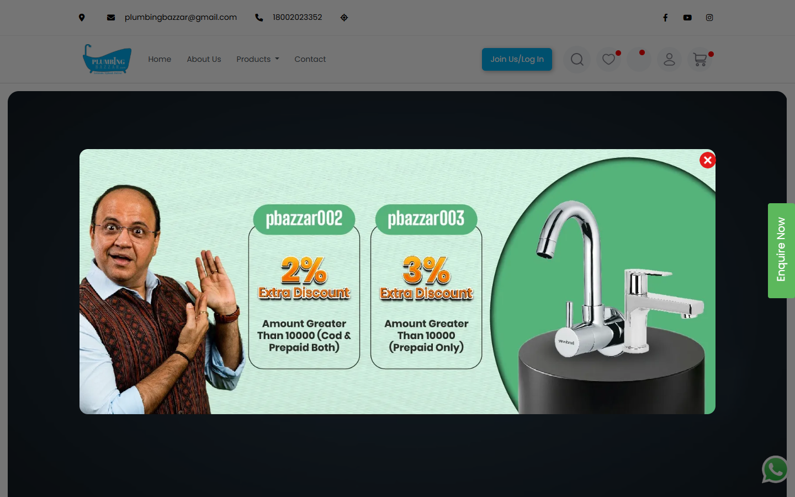

# Plumbing Bazzar eCommerce

Production website case study for a large sanitaryware and plumbing-products catalogue.

## Overview

Plumbing Bazzar provides online product discovery across sanitaryware, faucets, accessories, kitchen sinks, valves, designer basins and mirrors.

## Product Experience

- Responsive catalogue and category navigation
- Product pricing, offers, wish-list and cart flows
- Customer login and enquiry journeys
- Estimate upload workflow for large purchase requirements
- Content, testimonial and blog sections

## My Contribution

Selected professional work demonstrating UI implementation, responsive web design, eCommerce UX and business-focused front-end delivery.

## Live Website

[Visit Plumbing Bazzar](https://plumbingbazzar.com/)

> Portfolio case study. Brand names and website content belong to their respective owners.
